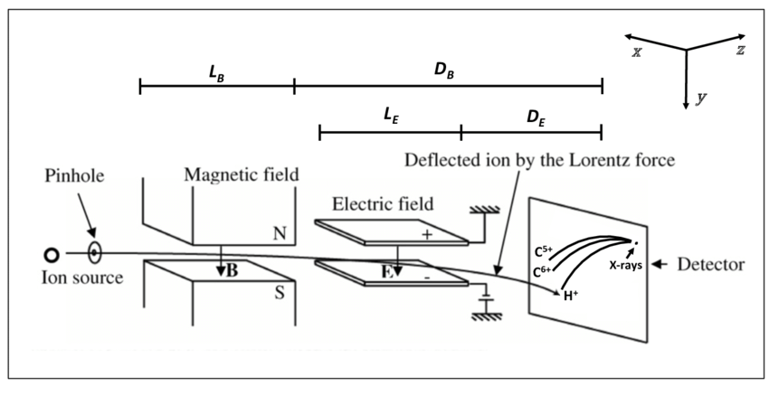
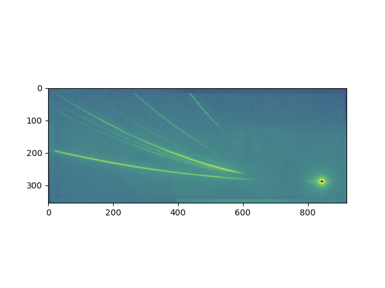

# Particle Orbit Theory

Particle orbit theory studies the dynamics of a single charged particle in assigned electric and magnetic fields. This will be the context to which we will apply some of the numerical schemes discussed in the [Introduction to Computational Plasma Physics](./Intro_Comp_Plasma_Phys.md). Charged particle dynamics provides useful hints to understand the physical behaviour of a charged population, and, thus, of a plasma. In the following, we adopt a classical description (not relativistic or quantum) and suppose that the field behaviour is completely given, no attempt is made at self-consistency. More accurate and self-consistent treatment of electromagnetic fields and particle motion to include the currents and induced fields resulting from the flow of charges can be done numerically. 

The charged particle dynamics comes from solving the following ordinary differential equations:

$$\dfrac{d\mathbf{x}}{dt}= \mathbf{v}$$

$$m \dfrac{d\mathbf{v}}{dt}=q(\mathbf{E}+\mathbf{v}\times\mathbf{B})$$

In general, $\mathbf{B} = \mathbf{B}(\mathbf{x}, t)$ and $\mathbf{E} = \mathbf{E}(\mathbf{x}, t)$ are functions of three spatial dimensions and of time. Therefore, we have a set of coupled, non-linear, ordinary differential equations for the unknowns $v$ and $x$ as functions of $t$. In the next sections, we study some specific conditions of assigned fields.

## $\mathbf{B}$ uniform and constant

In this case, the above differential equations reduce to:

$$ m \dfrac{d^2\mathbf{x}}{dt^2}=m\dfrac{d\mathbf{v}}{dt}=q(\mathbf{v}\times\mathbf{B})$$

Useful information can be derived on conserved quantities. Multiplying by $\cdot \mathbf{v}$ and by $\cdot \mathbf{B}$, we get:

$$\dfrac{dv^2}{dt}=0 \quad \mathbf{B}\cdot\dfrac{d\mathbf{v}}{dt} =0$$

Let's define the component of the velocity parallel to the magnetic field as:

$$v_\parallel=\mathbf{v}\cdot\dfrac{\mathbf{B}}{B}$$

$v_\parallel$, $v^2$, and $v_{\perp}^2$ are constant during the particle motion. The conclusion is that the kinetic energy of a particle in a static magnetic field is a constant. In other words, a static magnetic field can do no work on a charged particle because the Lorentz force is always perpendicular to the velocity and can
thus change only its direction, but not its magnitude. The conservation of the parallel velocity suggests to use cylindrical coordinates. Introducing the **cyclotron frequency** $\omega_c=qB/m$ (also called gyro frequency or Larmor frequency), we get:

$$\dfrac{dv_x}{dt}=\omega_c v_y \quad \dfrac{dv_y}{dt}=-\omega_c v_x \quad v_z=v_\parallel=const$$

which, once solved, leads to:

$$ x(t)=x_c+\rho_L \sin(\omega t+ \phi_0) \quad y(t)=y_c+\rho_L \cos(\omega t+ \phi_0)$$

where $(x_c,y_c)$ is called **guiding center** or Larmor centre, and $\rho_L=v_\perp/\omega_c$ is the cyclotron, gyro or **Larmor radius**. Note that the cyclotron frequency increases with the magnetic field $B$. Also, the electron gyro frequency is much larger than the ion gyro frequency, and the gyro radius increases with
the perpendicular velocity $v_\perp$ and decreases as the magnetic field $B$ increases.
 
The solutions describe a circular uniform motion in the $x-y$ plane characterized by the Larmor radius while along, the direction of the $\mathbf{B}$ field, the motion is uniform. The sign of the charge decides the direction of the circular motion. This kind of motion is called **cyclotron motion** or gyro motion. The guiding center  is the center of the particle orbit which exhibits good confinement perpendicular to the direction of the magnetic field and no confinement parallel to the magnetic field. The motion is analogous to a current flowing in a coil and produces a magnetic field that always opposes the applied $\mathbf{B}$: the gyro motion is diamagnetic.

## $\mathbf{B}$ and $\mathbf{F}$ uniform and constant

In this case, we have an additional force $\mathbf{F}$ of arbitrary orientation. For example, it could be the result of a constant electric field applied to the charge. The equation of motion now is:

$$m\dfrac{d\mathbf{v}}{dt}=q(\mathbf{v}\times\mathbf{B})+\mathbf{F}$$

We decompose this equation considering different components:

$$m\dfrac{d\mathbf{v}_\parallel}{dt}=\mathbf{F} _\parallel \quad m\dfrac{d\mathbf{v} _ \perp'}{dt}=q(\mathbf{v} _\perp'\times\mathbf{B}) \quad m\dfrac{d\mathbf{v} _{\perp c}}{dt}=q(\mathbf{v} _{\perp c}\times\mathbf{B})+\mathbf{F} _\perp$$

where $\mathbf{v}_\perp=\mathbf{v} _ \perp'+\mathbf{v} _{\perp c}$. In the parallel direction, there is a constant acceleration due to the parallel electric field. In the perpendicular direction, we have a component that follows the circular motion described in the previous section while another component is the velocity of the guiding center that now might also move.

We want to find a stationary solution for the guiding center if possible, by imposing that the time derivative of $\mathbf{v} _{\perp c}$ is zero:

$$\mathbf{v} _{\perp c} = \dfrac{\mathbf{F} _\perp \times \mathbf{B}} {q B^2}$$

This equation represents a **drift of the guiding center** orthogonal both to $\mathbf{F} _\perp$ and $\mathbf{B}$. The larmor radius in this case changes based on the position of the particle. 

If $\mathbf{F}=q\mathbf{E}$ the guiding center drift is called ExB drift:

$$\mathbf{v} _{\perp c} =\mathbf{v}_E= \dfrac{\mathbf{E} \times \mathbf{B}} {B^2}$$

It is independent of the particle charge and mass. In other words, electrons and ions, for example, drift with the same velocity.

Another example is the drift due to a constant gravitational force $F_g = mg$ perpendicular to the magnetic field. The resulting drift velocity, $v_g = mg/qB$ depends on the particle charge and mass. However, in laboratory plasmas, $v_g$ is far too small to be of importance.

## $\mathbf{B}$ and $\mathbf{E}$ non-uniform and non-constant

Let's start by defining spatial and temporal scales of variation of the system:

$$ L_\parallel= \left|\dfrac{\nabla_\parallel B}{B}\right|^{-1} \quad L_\perp= \left|\dfrac{\nabla_\perp B}{B}\right|^{-1} \quad T_B=\dfrac{1}{B} \dfrac{\partial B}{\partial t}$$

If $L_\parallel$ is much larger than the step of the helical motion $v_\parallel 2\pi/\omega_c$ (space transversed in one period of cyclotron motion in the direction parallel to $\mathbf{B}$), if $L_\perp$ is much larger than the Larmor radius, and if $T_B$, the variation of $B$ in time is much smaller than $\omega_c$, we can say that the particle will act as if the magnetic field is locally constant with the guiding center moving along the field lines. These considerations provide a strategy for studying particle orbits in arbitrary fields: by following the velocity and position of the guiding center one obtains an accurate picture of the average particle location, differing from the exact orbit by only a small deviation of the order of the Larmor radius. In this picture, the fastest and dominant behaviour corresponds to the cyclotron motion along magnetic field lines in which particles rotate in small circular orbits perpendicular to the magnetic field. At lower frequencies, slow spatial and time variations in the fields induce modifications of the basic cyclotron motion. Therefore, the variation of $\mathbf{B}$ is treated as a higher-order correction in the gyro motion. This is the **guiding center approximation**, proven valid in many cases of practical interest.

The analytical approach to the problem consists in decoupling the motion in a fast gyro motion and the slower guiding center motion comprising primarily the guiding center drifts:

$$ \mathbf{x}=\mathbf{x}_c+\mathbf{x}' \quad \mathbf{v}=\mathbf{v}_c+\mathbf{v}' $$

where $x'\ll x_c$. Now we can expand the magnetic field around the guiding center position and by averaging over the cyclotron period we can derive the equation for the guiding center:

$$m\dfrac{d\mathbf{v}_c}{dt}=q[\mathbf{v}_c\times\mathbf{B}(\mathbf{x}_c)]-\mu\nabla B(\mathbf{x}_c)+q\mathbf{E}(\mathbf{x}_c)$$

where $\mu=\langle \frac{1}{2} m v_\perp^2\rangle/B(\mathbf{x}_c)$ is the local average moment associated to the cyclotron motion. Instead, $\mathbf{v}'$ is described by the cyclotron motion around the guiding center.

Using a further decomposition of $\mathbf{v}_c$ in components parallel and perpendicular to  the magnetic field and imposing stationary behaviour we can find all the drifts to which the guiding center is subject. Here is the list of drifts and their meaning:

* **ExB drift** due to the electric field perpendicular to the magnetic field. The particle orbit has a larger radius of curvature on that part of its orbit in which the electric field accelerates the charge, i.e. increases its velocity. This drift is perpendicular to both the magnetic field and the electric field.

  $$\mathbf{v} _{\perp c} =\mathbf{v}_E= \dfrac{\mathbf{E} \times \mathbf{B}} {B^2}$$

* **$\nabla B$ drift** due to the transverse gradient of the magnetic field strength. The particle orbit has a smaller radius of curvature on that part of its orbit located in the stronger magnetic field. This drift is perpendicular to both the magnetic field and its gradient.

  $$\mathbf{v}_{\perp c}=-\dfrac{\mu}{qB^2}\nabla B \times \mathbf{B}$$

* **curvature drift** due to the curvature of the magnetic field lines. This drift is caused by the centrifugal force exerted on the particle.
  
  $$\mathbf{v}_{\perp c}=\dfrac{\mathbf{F}_c \times \mathbf{B}}{qB^2}$$
  
  where $\mathbf{F}_c=m v _\parallel^2 \mathbf{R_c}/R_c^2$ is the centrifugal force felt by the particle.

* **polarization drift** due to the lag of particle motion behind the changing electric field: ExB drift is not constant if the electric field depends on time. It depends on the charge and the mass of the particle.

  $$\mathbf{v}_{\perp c}=\dfrac{m}{qB^2} \dfrac{d\mathbf{E} _\perp}{dt}$$

These drifts are essential for understanding the currents that flow in plasma in many situations of practical interest for plasma-based devices.

## Thomson Parabola Spectrometer

This is the case of uniform and constant electric and magnetic fields applied perpendicular to the particle initial velocity. If the mass of the charged particle is large, then it undergoes small deflections and can be collected on a screen. On the screen, for ions of different starting energy, we see traces of parabolic shape depending on the ratio $Z/m$. 

||
|:--:|
|*Setup for measurements with Thomson parabola spectrometer ([link](https://www.researchgate.net/profile/Simon-Vallieres/publication/349578681/figure/fig32/AS:994909758685224@1614216379931/FIGURE-A1-Thomson-parabola-spectrometer-geometry-This-figure-is-extracted-and-adapted.png))*|

||
|:--:| 
|*Thomson parabola ion traces*|

## Bibliography

* Freidberg, J. P. (2008). Plasma Physics and Fusion Energy. (n.p.): Cambridge University Press. Chapter 8.

